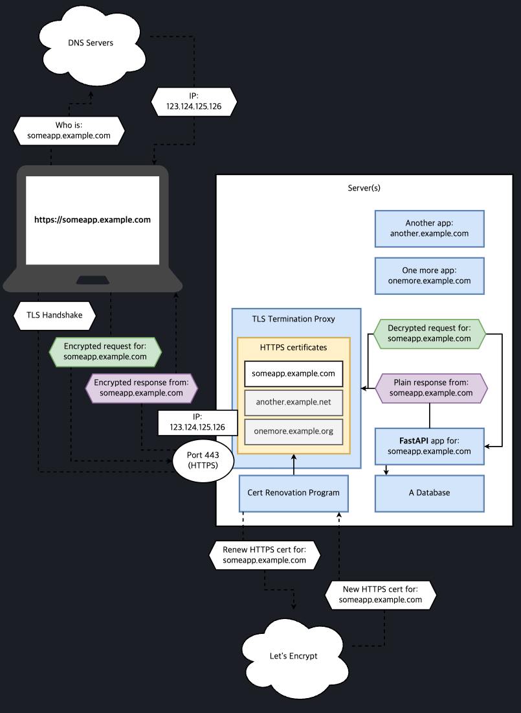

# [1. About FastAPI versions](https://fastapi.tiangolo.com/de/deployment/versions/)
- 현재 FastAPI의 버전이 `0.x.x` 인 이유는 현재로 정기적으로 새로운 기능이 추가되고 있고 계속해서 버그가 수정되고 있기 때문입니다.
- 현재 작성중인 애플리케이션에서 동작하는 fastpi 버전을 고정하세요
    ```
    fastapi==0.45.0
    또는
    fastapi>=0.45.0,<0.46.0
    ```
- 사용가능한 버전을 확인하세요 : [Release Notes.](https://fastapi.tiangolo.com/de/release-notes/)
- PATCH 버전에서는 버그나 non-breaking change를 포함합니다.
- MINOR 버전에서는 breaking change를 포함합니다.
- Test를 실행하여 FastAPI 버전을 업그레이드 하세요
- starlette 버전을 고정할 필요는 없습니다.
- pydantic은 FastAPI에 대한 테스트를 자체적으로 수행합니다.
<br/><br/>

# [2. About HTTPS](https://fastapi.tiangolo.com/de/deployment/https/)
- `HTTPS` 통신을 위해서 서버는 제 3자에 의해 생성된 `Certificates` 를 소유해야 합니다.
- `Certificates`는 만료되게 되며 제 3자에 의해 갱신되어야 합니다.
- 연결의 암호화는 HTTP 이전에 이루어 집니다.
- 하나의 HTTPS Certificates는 하나의 도메인은 보장하고 통신을 암호화하는데 이는 `TCP level`에서 일어나게 됩니다.
- Traefik, Caddy, Nginx, HAProxy 등의 `TLS Termination Proxy`를 사용할 수 있습니다.
- 리눅스 재단의 프로젝트인 `Let's Encrypt`를 무료로 사용할 수 있습니다.

## DNS
1. 웹브라우저는 `DNS 서버`에 도메인의 `IP`를 요청합니다.
2. **DNS 서버**는 당신이 DNS 서버에 등록한 특정 퍼블릭 IP를 반환해줍니다.<br/>
    (DNS 서버에 `A record`를 등록하므로써 당신의 서버의 IP를 등록할 수 있습니다.)
3. TLS handshake를 수행합니다. 브라우저는 해당 IP의 443 포트로 통신하게되고 브라우저와 서버간의 사용할 암호화 키를 결정합니다.
4. 하나의 포트는 하나의 프로세스에서 점유할 수 밖에 없는데 이 프로세스가 `TLS Termination Proxy`가 됩니다.
5. TLS Handshake 이후에 클라이언트와 서버는 암호화된 TCP 커넥션을 갖게도비니다.
6. 단순히 내부에 `TLS Connection`을 가지고 있는 HTTP 인것입니다.<br/>
    _암호화는 HTTP 레벨이 아닌 TCP 레벨에서 이루어진다는 점을 기억하세요._
7. 클라이언트에서 암호화된 HTTP 요청을 보내면 `TLS Termiantes Proxy` 에서는 해당 요청을 복호화 하여 내부 애플리케이션 ( ex. Uvicorn/FastAPI APP)으로 전달합니다.
8. 애플리케이션에서는 해당 요청을 처리한 후 HTTP 응답을 `TLS Termiantes Proxy` 로 전달합니다.
9. `TLS Termiantes Proxy`는 응답을 암호화하고 Client로 해당 응답을 반환합니다.
10. 하나의 IP를 통해 여러개의 도메인 등록이 가능합니다. ( feat. [SNI](https://chat.openai.com/share/0fe450f9-7527-4f34-8035-55cd1f84915a) )
11. Certificates를 갱신하기 위해 별도의 프로그램이 필요합니다.


TLS 인증은 IP가 아닌 도메인과 연관되어있다는 점에 유의하세요.

# [3. Run a Server Manually - Uvicorn](https://fastapi.tiangolo.com/de/deployment/manually/)
- ASGI의 3가지 대안이 있습니다.<br/>
  1. [Uvicorn](https://www.uvicorn.org/): a high performance ASGI server.
        ```
        $ pip install "uvicorn[standard]" # asyncio 대신 uvloop이 설치됩니다.
        $ uvicorn main:app --host 0.0.0.0 --port 80
        ```
  2. [Hypercorn](https://pgjones.gitlab.io/hypercorn/): an ASGI server compatible with HTTP/2 and Trio among other features.<br/>
        `Starlette`과 `FastAPI`는 python asyncio와 trio와 호환되는 `AnyIO`를 기반으로 한다.
        ```
        $ pip install "hypercorn[trio]"
        $ hypercorn main:app --worker-class trio # Trio 백엔드로 app을 구동
        ```
  3. [Daphne](https://github.com/django/daphne): the ASGI server built for Django Channels.
  
# [4. Deployments Concepts](https://fastapi.tiangolo.com/deployment/concepts/)
- 웹 서버를 배포할 경우 여러가지 컨셉이 있을 수 있습니다.
    - HTTPS, Running on startup, Restarts, Replication, Memory, Previous steps before starting
- 이러한 여러가지 컨셉을 고려하여 애플리케이션을 배포방식을 최적으로 설계할 수 있습니다.

## Security - HTTPS
- Traefik : 인증서 자동 갱신 ✨
- Caddy : 인증서 자동 갱신 ✨
- Nginx : 외부 프로세스 ( ex. Certbot )에 의한 인증서 갱신
- HAProxy : 외부 프로세스 ( ex. Certbot )에 의한 인증서 갱신
- Kubernetes with an Ingress Controller like Nginx : 외부 프로세스(ex. cert-manager)에 의한 인증서 갱신
- Handled internally by a cloud provider as part of their services (read below 👇)

## Example Tools to Run at Startup
- Docker, K8S, DockerCompose
- Docker in Swarm Mode
- Systemd
- Supervisor
- Handled internally by a cloud provider as part of their services
- others...

## Restart After Crash
- there might be cases where we write some code that crashes the entire application making Uvicorn and Python crash
- But in those cases with really bad errors that crash the running process, you would want an external component that is in charge of restarting the process, at least a couple of times...
- Example Tools to Restart Automatically
    - Docker, Kubernetes, Docker Compose, Docker in Swarm Mode
    - Systemd, Supervisor
    - Handled internally by a cloud provider as part of their services
    - Others...